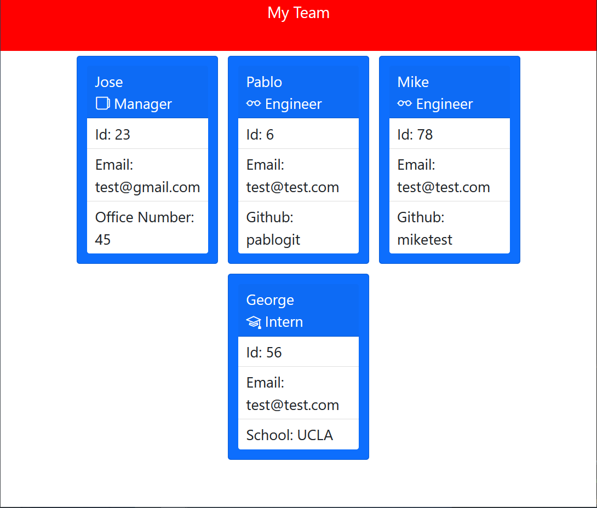

# jest-test-team-generator

## Description
The purpose of this project is to utilize the Jest testing library and build tests around development components.  
In addition, I used fs to write the html document, and Inquirer to take user input.

## Tests Passing Demo
In this challenge, 4 objects were built, and the components within those objects tested.
As seen below, all tests pass.

## HTML Generated
This is a screenshot of the html generated after the information has been entered.  
For the purposes of this demo, 4 total employees need to be entered as the html was hardcoded for 4 employees.

## App Demo

Link: https://drive.google.com/file/d/1SRsHS9uF1CY8W0OHxUtd2BEF7ph18bx-/view